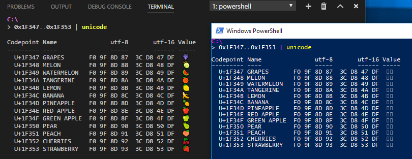

# UniShell

A cross-platform PowerShell module for displaying and exploring Unicode.

## Quickstart

Install from the [PowerShell Gallery](https://www.powershellgallery.com/packages/UniShell) (Windows-only, PS v5+):

```
> Install-Module -Name UniShell
```

Direct download:

```
'UniShell.psd1','unishell.psm1','lib.ps1','tables.ps1' |% {
    Invoke-WebRequest https://raw.githubusercontent.com/latkin/unishell/master/$_ -OutFile ./$_
}

Import-Module ./UniShell.psd1
```

## Cmdlets

### Get-UniCodepoint

Gets Unicode codepoint information from an input string or list of integer codepoints.
Alias `unicode`.

**See what codepoints a string comprises**
```
> 'dude, swẽêt' | unicode

dude, swẽêt

  Codepoint Name                                        utf-8       utf-16 Value
  --------- ----                                        -----       ------ -----
┌─   U+0064 LATIN SMALL LETTER D                           64        64 00   d
├─   U+0075 LATIN SMALL LETTER U                           75        75 00   u
├─   U+0064 LATIN SMALL LETTER D                           64        64 00   d
├─   U+0065 LATIN SMALL LETTER E                           65        65 00   e
├─   U+002C COMMA                                          2C        2C 00   ,
├─   U+0020 SPACE                                          20        20 00
├─   U+0073 LATIN SMALL LETTER S                           73        73 00   s
├─   U+0077 LATIN SMALL LETTER W                           77        77 00   w
├─   U+1EBD LATIN SMALL LETTER E WITH TILDE          E1 BA BD        BD 1E   ẽ
├─   U+00EA LATIN SMALL LETTER E WITH CIRCUMFLEX        C3 AA        EA 00   ê
└─   U+0074 LATIN SMALL LETTER T                           74        74 00   t
```
```
> 'குட்மானிங்' | unicode -encoding utf-8,utf-32BE

குட்மானிங்

  Codepoint Name                       utf-8     utf-32BE Value
  --------- ----                       -----     -------- -----
┌┬   U+0B95 TAMIL LETTER KA         E0 AE 95  00 00 0B 95   க
│└   U+0BC1 TAMIL VOWEL SIGN U      E0 AF 81  00 00 0B C1   ு
├┬   U+0B9F TAMIL LETTER TTA        E0 AE 9F  00 00 0B 9F   ட
│└   U+0BCD TAMIL SIGN VIRAMA       E0 AF 8D  00 00 0B CD   ்
├┬   U+0BAE TAMIL LETTER MA         E0 AE AE  00 00 0B AE   ம
│└   U+0BBE TAMIL VOWEL SIGN AA     E0 AE BE  00 00 0B BE   ா
├┬   U+0BA9 TAMIL LETTER NNNA       E0 AE A9  00 00 0B A9   ன
│└   U+0BBF TAMIL VOWEL SIGN I      E0 AE BF  00 00 0B BF   ி
└┬   U+0B99 TAMIL LETTER NGA        E0 AE 99  00 00 0B 99   ங
 └   U+0BCD TAMIL SIGN VIRAMA       E0 AF 8D  00 00 0B CD   ்
```
```
> 'U̶͔͑n̴̜̐i̷̢̎Ṣ̴́h̴̺̽e̵͙̕ļ̴̆l̶͔̏' | unicode

U̶͔͑n̴̜̐i̷̢̎Ṣ̴́h̴̺̽e̵͙̕ļ̴̆l̶͔̏

  Codepoint Name                                        utf-8       utf-16 Value
  --------- ----                                        -----       ------ -----
┌┬   U+0055 LATIN CAPITAL LETTER U                         55        55 00   U
│├   U+0336 COMBINING LONG STROKE OVERLAY               CC B6        36 03   ̶
│├   U+0351 COMBINING LEFT HALF RING ABOVE              CD 91        51 03   ͑
│└   U+0354 COMBINING LEFT ARROWHEAD BELOW              CD 94        54 03   ͔
├┬   U+006E LATIN SMALL LETTER N                           6E        6E 00   n
│├   U+0334 COMBINING TILDE OVERLAY                     CC B4        34 03   ̴
│├   U+0310 COMBINING CANDRABINDU                       CC 90        10 03   ̐
│└   U+031C COMBINING LEFT HALF RING BELOW              CC 9C        1C 03   ̜
├┬   U+0069 LATIN SMALL LETTER I                           69        69 00   i
│├   U+0337 COMBINING SHORT SOLIDUS OVERLAY             CC B7        37 03   ̷
│├   U+030E COMBINING DOUBLE VERTICAL LINE ABOVE        CC 8E        0E 03   ̎
│└   U+0322 COMBINING RETROFLEX HOOK BELOW              CC A2        22 03   ̢
├┬   U+0053 LATIN CAPITAL LETTER S                         53        53 00   S
│├   U+0334 COMBINING TILDE OVERLAY                     CC B4        34 03   ̴
│├   U+0301 COMBINING ACUTE ACCENT                      CC 81        01 03   ́
│└   U+0323 COMBINING DOT BELOW                         CC A3        23 03   ̣
├┬   U+0068 LATIN SMALL LETTER H                           68        68 00   h
│├   U+0334 COMBINING TILDE OVERLAY                     CC B4        34 03   ̴
│├   U+033D COMBINING X ABOVE                           CC BD        3D 03   ̽
│└   U+033A COMBINING INVERTED BRIDGE BELOW             CC BA        3A 03   ̺
├┬   U+0065 LATIN SMALL LETTER E                           65        65 00   e
│├   U+0335 COMBINING SHORT STROKE OVERLAY              CC B5        35 03   ̵
│├   U+0315 COMBINING COMMA ABOVE RIGHT                 CC 95        15 03   ̕
│└   U+0359 COMBINING ASTERISK BELOW                    CD 99        59 03   ͙
├┬   U+006C LATIN SMALL LETTER L                           6C        6C 00   l
│├   U+0334 COMBINING TILDE OVERLAY                     CC B4        34 03   ̴
│├   U+0306 COMBINING BREVE                             CC 86        06 03   ̆
│└   U+0327 COMBINING CEDILLA                           CC A7        27 03   ̧
└┬   U+006C LATIN SMALL LETTER L                           6C        6C 00   l
 ├   U+0336 COMBINING LONG STROKE OVERLAY               CC B6        36 03   ̶
 ├   U+030F COMBINING DOUBLE GRAVE ACCENT               CC 8F        0F 03   ̏
 └   U+0354 COMBINING LEFT ARROWHEAD BELOW              CD 94        54 03   ͔
```

**See info about individual codepoints, or a range of codepoints**
```
> 0x1F347..0x1F353 | unicode

Codepoint Name               utf-8       utf-16 Value
--------- ----               -----       ------ -----
  U+1F347 GRAPES       F0 9F 8D 87  3C D8 47 DF  🍇
  U+1F348 MELON        F0 9F 8D 88  3C D8 48 DF  🍈
  U+1F349 WATERMELON   F0 9F 8D 89  3C D8 49 DF  🍉
  U+1F34A TANGERINE    F0 9F 8D 8A  3C D8 4A DF  🍊
  U+1F34B LEMON        F0 9F 8D 8B  3C D8 4B DF  🍋
  U+1F34C BANANA       F0 9F 8D 8C  3C D8 4C DF  🍌
  U+1F34D PINEAPPLE    F0 9F 8D 8D  3C D8 4D DF  🍍
  U+1F34E RED APPLE    F0 9F 8D 8E  3C D8 4E DF  🍎
  U+1F34F GREEN APPLE  F0 9F 8D 8F  3C D8 4F DF  🍏
  U+1F350 PEAR         F0 9F 8D 90  3C D8 50 DF  🍐
  U+1F351 PEACH        F0 9F 8D 91  3C D8 51 DF  🍑
  U+1F352 CHERRIES     F0 9F 8D 92  3C D8 52 DF  🍒
  U+1F353 STRAWBERRY   F0 9F 8D 93  3C D8 53 DF  🍓
```
```
> 0..100 | Get-Random -Count 10 | unicode

Codepoint Name                                  utf-8       utf-16 Value
--------- ----                                  -----       ------ -----
   U+004B LATIN CAPITAL LETTER K                   4B        4B 00   K
   U+0048 LATIN CAPITAL LETTER H                   48        48 00   H
   U+0014 <control> DEVICE CONTROL FOUR      E2 90 94        14 24   ␔
   U+0015 <control> NEGATIVE ACKNOWLEDGE     E2 90 95        15 24   ␕
   U+0027 APOSTROPHE                               27        27 00   '
   U+000C <control> FORM FEED (FF)           E2 90 8C        0C 24   ␌
   U+0007 <control> BELL                     E2 90 87        07 24   ␇
   U+0050 LATIN CAPITAL LETTER P                   50        50 00   P
   U+002E FULL STOP                                2E        2E 00   .
   U+002C COMMA                                    2C        2C 00   ,
```

**See detailed Unicode properties of individual codepoints, and customize what
encodings are displayed**
```
> 0x10B7F | unicode -e utf-* | Format-List


Value                     : 𐭿
Codepoint                 : U+10B7F
Name                      : INSCRIPTIONAL PAHLAVI NUMBER ONE THOUSAND
Block                     : Inscriptional Pahlavi
Plane                     : 1 - Supplementary Multilingual Plane
UnicodeVersion            : 5.2
Script                    : Inscriptional_Pahlavi
LineBreakClass            : AL - Alphabetic
Category                  : No - Number, Other
CanonicalCombiningClasses : 0 - Spacing, split, enclosing, reordrant, and Tibetan subjoined
BidiCategory              : R - Right-to-Left
DecompositionMapping      :
DecimalDigitValue         :
DigitValue                :
NumericValue              : 1000
Mirrored                  : False
UppercaseMapping          :
LowercaseMapping          :
TitlecaseMapping          :
utf-16                    : 02 D8 7F DF
utf-16BE                  : D8 02 DF 7F
utf-32                    : 7F 0B 01 00
utf-32BE                  : 00 01 0B 7F
utf-7                     : 2B 32 41 4C 66 66 77 2D
utf-8                     : F0 90 AD BF
```

### Get-UniByte

Gets the bytes associated with a binary encoding of the specified Unicode string
or codepoints. Alias `unibyte`.

Serves as a handy shortcut for `[System.Text.Encoding]::<encoding>.GetBytes(<string>)`.

```
# get the UTF-16 bytes of the Mandarin word 筷子
> '筷子' | unibyte -e utf-16

119
123
80
91
```

### Get-UniString

Gets the string generated by decoding the input bytes according to the specified
encoding, or by combining the specified codepoints. Alias `unistring`.

```
# decode a Mandarin word based on its UTF-16 bytes
> 119, 123, 80, 91 | unistring -e utf-16

筷子
```
```
# combine codepoints to form a string
> 0x6d,0x65,0x68,0x20,0x1f937 | unistring

meh 🤷
```
```
# discover conspiracies!
> '畂桳栠摩琠敨映捡獴' | unibyte -e utf-16 | unistring -e us-ascii

Bush hid the facts
```

## Notes

**For Windows users**

The built-in terminals in Windows have poor support for Unicode strings.
For best results, use an alternative terminal such as [ConEmu](https://conemu.github.io/),
[Visual Studio Code](https://code.visualstudio.com/), or others.



**For non-Windows users**

[PowerShell Core](https://github.com/powershell/powershell) currently only supports
a small number of encodings (utf-{7,8 & 16,32 both LE/BE}, us-ascii, and iso-8859-1), whereas
Windows PowerShell supports 140 different encodings or codepages. This module only offers
access to encodings that are available in your environment.

**Thanks**

Original idea of a Unicode dumper util was [my own](https://twitter.com/LincolnAtkinson/status/915117558772072448) (though
[hardly](https://twitter.com/miestasmia/status/915119479155240960) [original](https://twitter.com/willkirkby/status/915508043470786560)),
but codepoint presentation, particularly the combining character guidemarks and control character
replacements, was heavily influenced by [uniscribe](https://github.com/janlelis/uniscribe) and its dependencies.
So big thanks and hat tip to that project!